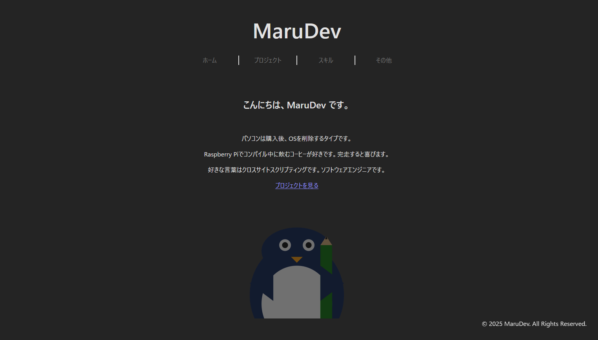
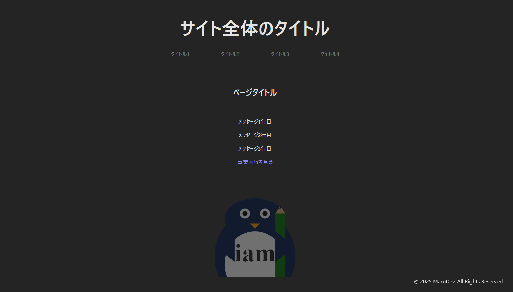
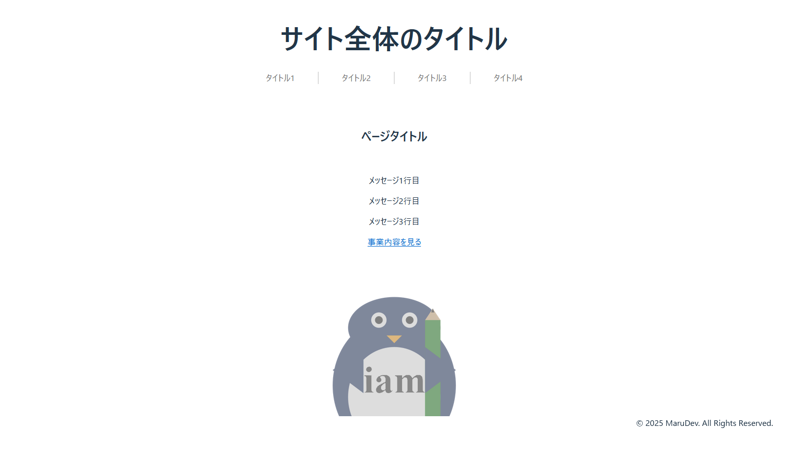
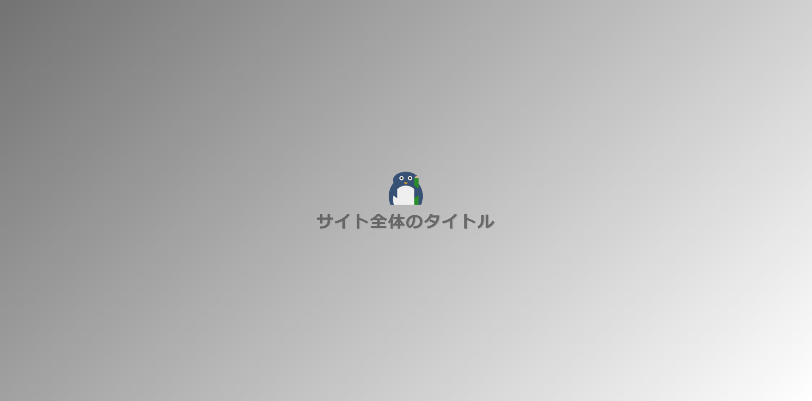
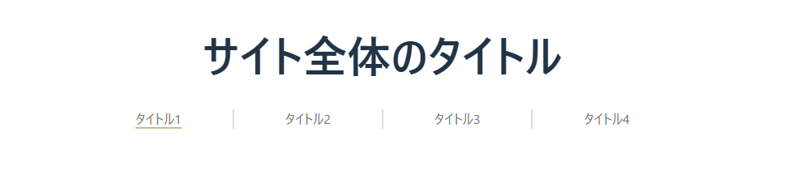
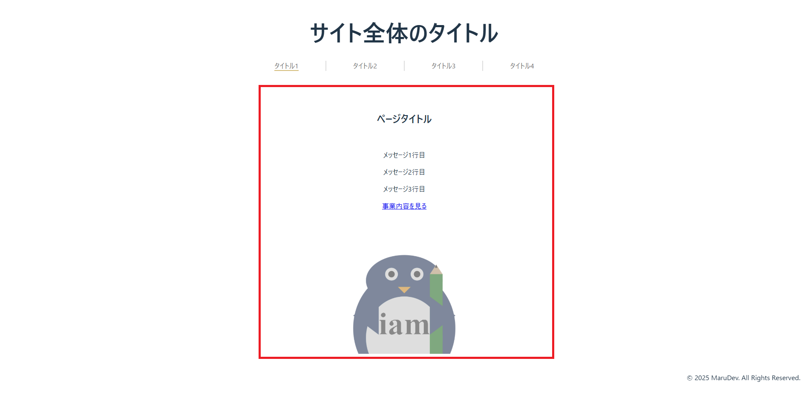
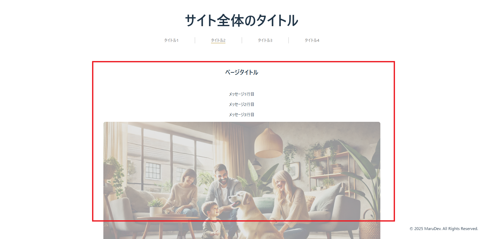
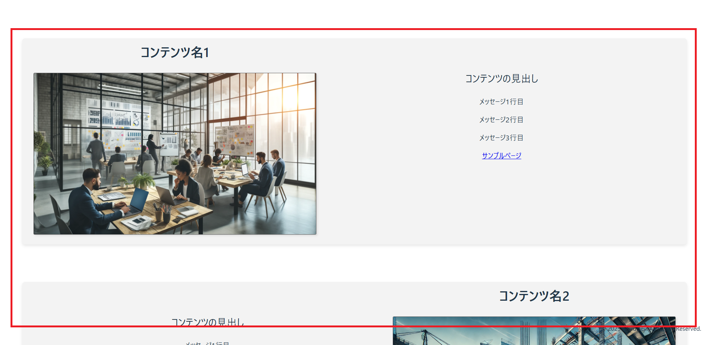
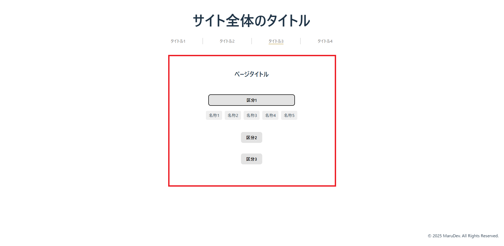
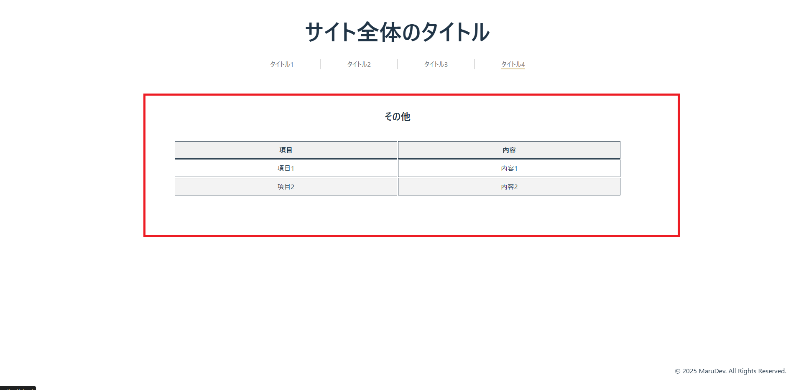

# iam

## プロジェクトの概要

この記事は「**iam**」は、Vue3 + Vite + TypeScriptを使用して構築したシングルページアプリケーション（SPA）の構築ツールです。



はじめは個人のポートフォリオサイト構築を目的に、開発を進めてきましたが、汎用静的サイト作成ツールとして舵を切りました。

### iamの用途

設定ファイル（JSONファイル）を編集し、さまざまな用途のサイトを素早く生成可能です。この特性により、次のことが実現可能と考えています。

#### 実現可能な内容

- **一時的な特設サイトの構築**
    - 期間限定特設ページ（企業採用やキャンペーン）
    - 商品紹介ページ
    - 組織内部でのプレゼン用途
- **ポートフォリオサイト構築**
    - 個人のポートフォリオ
    - プロジェクトサイト

```bash
注意点
提供するコンテンツはバックエンドにデータを保持しない静的なコンテンツです。扱う情報はすべてパブリックなもので、セキュア情報は保持しません。
```

### 使用技術

- **フロントエンド**: Vue 3 + Vite + TypeScript
- **スタイリング**: CSS
- **配信**: Docker、Nginx、Cloudflare Pagesなど

### 必要知識

- **npmコマンド**
- **JSONファイルの編集**
- **Docker（配信まで全て行う場合）**

## 実装サンプル

1. **プロジェクトをクローン：**
    
    [リポジトリ](https://github.com/itsuki-maru/iam) から直接ダウンロード、またはGitでクローンします。
    
    ```shell
    git clone https://github.com/itsuki-maru/iam.git
    ```

2. **必要パッケージをインストール：**
    
    Vue3などの必要パッケージを導入します。
    
    ```shell
    cd iam
    npm install
    ```

3. **開発起動：**

    まずは開発起動で初期ページを確認します。
    ```shell
    npm run dev
    ```
    起動したら [http://localhost:5173](http://localhost:5173) にアクセスします。

- **ダークテーマ:**

    

- **ライトテーマ:**

    

## Dockerによる運用

より汎用性を持たせるため、Dockerコンテナも用意しました。DockerではVue3のビルドからNginxによるホスティングまでを一括して実行します。

1. **プロジェクトをクローン：**
    
    ```shell
    git clone https://github.com/itsuki-maru/iam.git
    ```

2. **Dockerfileをビルド**:
   
    ```bash
    docker build -t iam-nginx-app .
   ```

3. **コンテナを起動しNginxにより配信**:
    ```bash
    docker run -d -p 80:80 --name iam iam-nginx-app
    ```

**ビルドとNginxの起動を同時に行う。**

```bash
docker build -t iam-nginx-app . && docker run -d -p 80:80 --name iam iam-nginx-app
```

## 設定ファイル-config.json-

特に目新しい仕組みではないですが、コンテンツをHTMLやコンポーネント内にハードコーディングせず、`config.json`という外部ファイルから動的にロードしています。

```bash
iam
 ├─public
 │  ├─ config.json
```

これにより、ポートフォリオだけでなく一時的な特設サイトなども簡単です。

また、画像ファイルなども `public` 配下に保存することで `/example.png` といった形でアクセス可能となります。

設定ファイルの校正は次のとおりです。

### 1. サイト全般の設定

アクセス時のスプラッシュスクリーンやサイト名、問い合わせ先といった基本的な項目を設定します。

**スプラッシュスクリーン**



**サイトヘッダー**



#### 設定項目

- **appTitle:** サイトのタイトル
- **appLogo:** サイトロゴ
    - 他のリソースも指定可能です。
    - プロジェクトディレクトリのpublic配下に保存した際は`/your-image-name.png`と指定します。
- **contactEmailAddress:** 問い合わせ用のメールアドレス設定
- **headers:** サイトヘッダータブリンク
    - head1:
        - **title**: head1ヘッダーリンクのタイトル
        - **isShow**: true か false （有効化するか否か）
    - head2~head4: 以降同様

```json
{
    "appTitle": "サイト全体のタイトル",
    "appLogo": "/logo.png",
    "contactEmailAddress": "example@example.com",
    "headers": {
        "head1": {
            "title": "タイトル1",
            "isShow": true
        },
        "head2": {
            "title": "タイトル2",
            "isShow": true
        },
        "head3": {
            "title": "タイトル3",
            "isShow": true
        },
        "head4": {
            "title": "タイトル4",
            "isShow": true
        }
    },
```

### 2. homeタブコンテンツの設定

`/home` ルーティング内のコンテンツで、ページをロード後に最初に表示されるタブコンテンツです。



#### 設定項目

- **title**: ページのタイトル
- **imageUrl**: ページのメイン画像
- **productLinkText**: `/product`への遷移リンクに使用する文字列
- **message**: 複数行のメッセージを配列で記述

```json
"home": {
    "title": "ページタイトル",
    "imageUrl": "/icon-512x512.png",
    "productLinkText": "事業内容を見る",
    "message": [
        "メッセージ1行目",
        "メッセージ2行目",
        "メッセージ3行目"
    ]
},
```

### 3. productタブコンテンツの設定

`/pruduct`内のコンテンツで、このサイトの主となるプロダクトなどを紹介するタブとなります。

#### (1) タブの全般設定項目



- **title**: ページのタイトル
- **imageUrl**: ページのメイン画像
- **message**: 複数行のメッセージを配列で記述

```json
"product": {
    "title": "ページタイトル",
    "imageUrl": "/project-page-top.png",
    "message": [
        "メッセージ1行目",
        "メッセージ2行目",
        "メッセージ3行目"
    ],
```

#### (2) タブの内のコンテンツ設定項目

`products`内は配列となっており、下記要素を複数記述可能です。



- **productName**: 紹介したいプロダクトコンテンツの名称
- **imageUrl**: プロダクトのメイン画像
- **productDetail**: プロダクトの紹介文章見出し
- **productDetailMessage**: プロダクトの紹介文
    - 複数行記述可能。
- **productLink**: プロダクトの詳細リンクなど
    - メール問合せは`/contact`を指定し、後述する`productLinkIsBlank`を`false`に設定
- **productLinkText**: プロダクトの詳細リンクの文字列
- **productLinkIsBlank**: リンクを別タブで開かせるか否か

```json
"products": [
    {
        "productName": "コンテンツ名1",
        "imageUrl": "/project-sample1.png",
        "productDetail": "コンテンツの見出し",
        "productDetailMessage": [
            "メッセージ1行目",
            "メッセージ2行目",
            "メッセージ3行目"
        ],
        "productLink": "https://example.com",
        "productLinkText": "サンプルページ",
        "productLinkIsBlank": true
    }...続けて記述可能
]
```

### 4. listタブコンテンツの設定

`/lists` ルーティング内のコンテンツで、ボタンを押下することで2階層のツリーを表示させることができるタブコンテンツです。



#### 設定項目

`lists`内は配列となっており、複数ルートボタン要素を記述可能です。

- **title**: ページのタイトル
- **lists**: ツリー構造となるコンテンツ
    - **name**: ルートのボタン名称を設定。
    - **items**: ルートのボタン配下の要素を設定

```json
"list": {
    "title": "ページタイトル",
    "lists": [
        {
            "name": "区分1",
            "items": [
                "名称1",
                "名称2",
                "名称3",
                "名称4",
                "名称5"
            ]
        }
    ]
},
```

### 5. aboutタブコンテンツの設定

`/about` ルーティング内のコンテンツで、テーブル形式で表示されるタブコンテンツです。



#### 設定項目

`abouts`内は配列となっており、複数行のテーブルを設定可能です。

- **title**: ページのタイトル
- **abouts**: テーブル内の構成
    - **key**: 行内のテーブルの最左列データ
    - **value**: keyに対する値を設定

```json
"about": {
    "title": "その他",
    "abouts": [
        {
            "key": "項目1",
            "value": "内容1"
        },
        {
            "key": "項目2",
            "value": "内容2"
        }
    ]
}
```

### 6. 設定ファイル全体

最後に `config.json` の全体像です。

```json
{
    "appTitle": "サイト全体のタイトル",
    "appLogo": "/logo.png",
    "contactEmailAddress": "example@example.com",
    "headers": {
        "head1": {
            "title": "タイトル1",
            "isShow": true
        },
        "head2": {
            "title": "タイトル2",
            "isShow": true
        },
        "head3": {
            "title": "タイトル3",
            "isShow": true
        },
        "head4": {
            "title": "タイトル4",
            "isShow": true
        }
    },
    "home": {
        "title": "ページタイトル",
        "imageUrl": "/icon-512x512.png",
        "productLinkText": "事業内容を見る",
        "message": [
            "メッセージ1行目",
            "メッセージ2行目",
            "メッセージ3行目"
        ]
    },
    "product": {
        "title": "ページタイトル",
        "imageUrl": "/project-page-top.png",
        "message": [
            "メッセージ1行目",
            "メッセージ2行目",
            "メッセージ3行目"
        ],
        "products": [
            {
                "productName": "コンテンツ名1",
                "imageUrl": "/project-sample1.png",
                "productDetail": "コンテンツの見出し",
                "productDetailMessage": [
                    "メッセージ1行目",
                    "メッセージ2行目",
                    "メッセージ3行目"
                ],
                "productLink": "https://example.com",
                "productLinkText": "サンプルページ",
                "productLinkIsBlank": true
            },
            {
                "productName": "コンテンツ名2",
                "imageUrl": "/project-sample2.png",
                "productDetail": "コンテンツの見出し",
                "productDetailMessage": [
                    "メッセージ1行目",
                    "メッセージ2行目",
                    "メッセージ3行目"
                ],
                "productLink": "/contact",
                "productLinkText": "お問い合わせはこちらから",
                "productLinkIsBlank": false
            }
        ]
    },
    "list": {
        "title": "ページタイトル",
        "lists": [
            {
                "name": "区分1",
                "items": [
                    "名称1",
                    "名称2",
                    "名称3",
                    "名称4",
                    "名称5"
                ]
            }
        ]
    },
    "about": {
        "title": "その他",
        "abouts": [
            {
                "key": "項目1",
                "value": "内容1"
            },
            {
                "key": "項目2",
                "value": "内容2"
            }
        ]
    }
}
```

## その他

ぜひご意見、フィードバックをお寄せください。